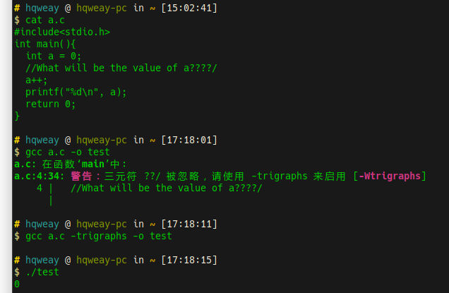
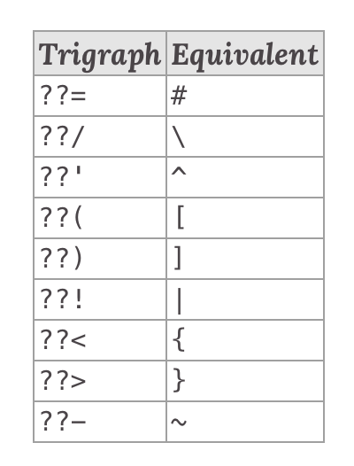

## TL;DR

当初由于 ISO646 标准，部分国家的程序员打不出 `{`、`}` 等字符，所以 ANSI C 委员会引入了三元符。但三元符的使用可能会产生一些有趣的效果……

## 测试效果

gcc version ：gcc (GCC) 9.2.0



## 正文

原文：[C, what the fuck??!](https://bowero.nl/blog/2019/12/15/c-what-the-fuck/)

_December 2019_

下面这段代码执行后，变量 `a` 的值应该是多少？

```c
int a = 0;
// What will be the value of a????/
a++;
```

哈哈，既然我这样问了，你可能会觉得至少 `a` 的值不应该是 `1`。

实际上呢， `a` 的值仍然是 `0`，不会改变，因为 `a++;` 这行代码根本不会被执行。在 `a++;` 上面的那段注释里发生了些特殊的事情。

在讨论这个问题前，让我们先看看下面这个例子。

```c
!didIMakeAMistake() ??!??! CIsWrongHere();
```

首先，这段代码居然能能通过编译！这是咋回事？

要理解这个问题，首先要保证代码运行在现代版本的 `gcc` 环境并且开启了参数 `-trigraphs`（三元符）。 三元符是为了 [the ISO/IEC 646 Invariant character set](https://www.gs1tw.org/twct/gs1w/download/DataMatrix_Character.pdf) （ISO646 标准）中缺少的 9 个字符而发明的特殊字符组合。让我们看看 ISO646 标准中的字符。


Image: [Wikipedia](https://www.wikiwand.com/en/ISO/IEC_646)

经常使用 C 的朋友应该一眼就看出这里缺少了哪 9 个字符吧，它们是这几个：

```plaintext
 ## \ ^ [ ] | { } ~
```

有的朋友看了上面的表格可能会反倒感到困惑，哪儿缺少了，这 9 个字符不都在表格里吗？哈哈，注意一下，这 9 个字符都是灰色的，因为他们是各个国家的规则而不是国际规则。

有趣起来啦，让我们看个简单的例子：

```C
{ a[i] = '\n'; }
```

上面这段简单的代码要是由一个瑞典程序员来写的话，可能是这样的：

```C
ä aÄiÜ = 'Ön'; ü
```

为啥？因为他们那儿的字符规则里使用的字符和美国程序员不同嘛。

ANSI C 委员会自然也认识到这个问题了，于是它们决定引入三元符。用 9 种标准的字符组合来替换那些不标准的字符。



Image: [Wikipedia](https://en.wikipedia.org/wiki/Digraphs_and_trigraphs)

这种解决方案当然不太优雅，但至少能用。

晓得了这些，我们再来看一下前面的几段代码。首先是后面那段简单点的：

```C
!didIMakeAMistake() ??!??! CIsWrongHere();
```

查看一下上面的表格，我们就知道这段代码里的 `??!` 实际上应该被取代为 `|`。因此这行代码的实际内容其实是：

```C
!didIMakeAMistake() || CIsWrongHere();
```

如果你理解 [short-circuit evaluation](https://en.wikipedia.org/wiki/Short-circuit_evaluation) （短路求值）是怎么工作的，那你就应该知道这行代码也可以表示为：

```C
if (didIMakeAMistake())
  CIsWrongHere();
```

前面提到的第一个例子就更有趣啦，这也是一个我们为什么应该谨慎使用三元符的典例。

```C
int a = 0;
// What will be the value of a????/
a++;
```

上面已经说过啦，这段代码执行后，变量 `a` 的值实际上还是 `0`，因为 `a++;` 根本就不会被执行。

注意，只有当 `??` 后面跟随的字符在上面表格里的 9 个字符串里面，`??` 与该字符组成的字符串才会被识别为三元组。所以 C 预处理器将会把上面的代码处理为：

```C
int a = 0;
// What will be the value of a??\
a++;
```

这里的 `\` 实际上是换行的转移符，所以这段代码实际上又相当于：

```C
int a = 0;
// What will be the value of a??a++;
```

你瞧，这就是为什么 `a++;` 不会被执行。

I would like to end with a note from the committee itself:

> The Committee makes no claims that a program written using trigraphs looks attractive. As a matter of style, it may be wise to surround trigraphs with white space, so that they stand out better in program text. Some users may wish to define preprocessing macros for some or all of the trigraph sequences.
>
> [Rationale for International Standard Programming Languages C](http://www.open-std.org/jtc1/sc22/wg14/www/C99RationaleV5.10.pdf) (5.2.1.1)
